<p align="center">
  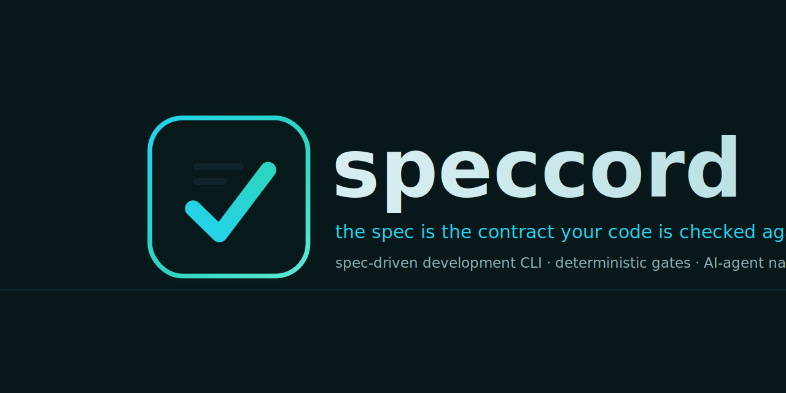
</p>

<p align="center">
  <a href="https://krishnachaitanyap.github.io/speccord/">Live demo</a> ·
  <a href="USAGE.md">Usage guide</a> ·
  <a href="#architecture">Architecture</a> ·
  <a href="#integrate-with-ai-agents-claude-code-cursor-copilot">AI agents</a>
</p>

# speccord

A spec-driven-development CLI that treats the spec as the **executable contract your code is
continuously checked against.** speccord works in **both directions** and keeps the two in sync:

- **Extract** — discover the as-is contract of an existing service (API, data, events, security) and
  turn it into a spec the code is measured against.
- **Generate** — go the other way for new work: constitution → spec → plan → tasks → implementation,
  with role personas and context-engineered stories.
- **Enforce** — a lifecycle state machine with entry gates, a CI **drift gate**, and runtime
  **conformance** that fail the build when code and spec disagree.

You pick **how much process** with one number (the *scale*); everything else — which phases run,
which roles exist, which capabilities switch on — derives from it and is individually overridable.

```
ANALYSIS            PLANNING              SOLUTIONING            IMPLEMENTATION
brief (analyst)     prd (pm)              base spec (architect)  story new (sm)
research            ux                    plan / epics+stories   implement (dev)
discover ───────────────────────────────► base spec             review (qa)
(existing service)                                               advance · gate · conform
```

**Hybrid by construction:** facts and decisions are **deterministic** (parsers, diffs, gates, the
lifecycle, drift — all code). **Only prose is model-written**, always grounded in facts the tool
already established — so the model never invents an endpoint, table, or scope, and pass/fail is never
a prompt.

> New here? Read **[USAGE.md](USAGE.md)** — concepts plus full tutorials (existing-service, new-service,
> and a product run).

## Overview deck

A slide walkthrough of what speccord is and how to use it.

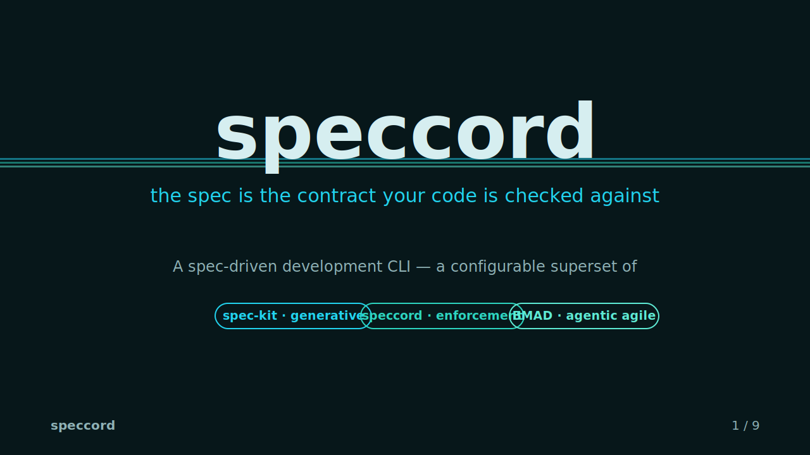

<details>
<summary><b>📊 View the full deck (9 slides)</b> &nbsp;·&nbsp; <a href="docs/speccord-deck.pptx">download .pptx</a></summary>

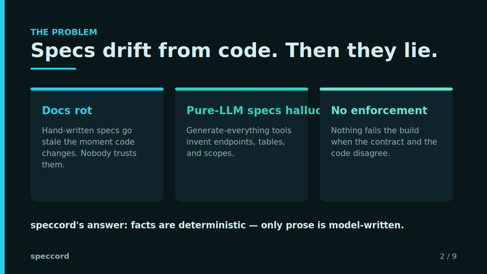

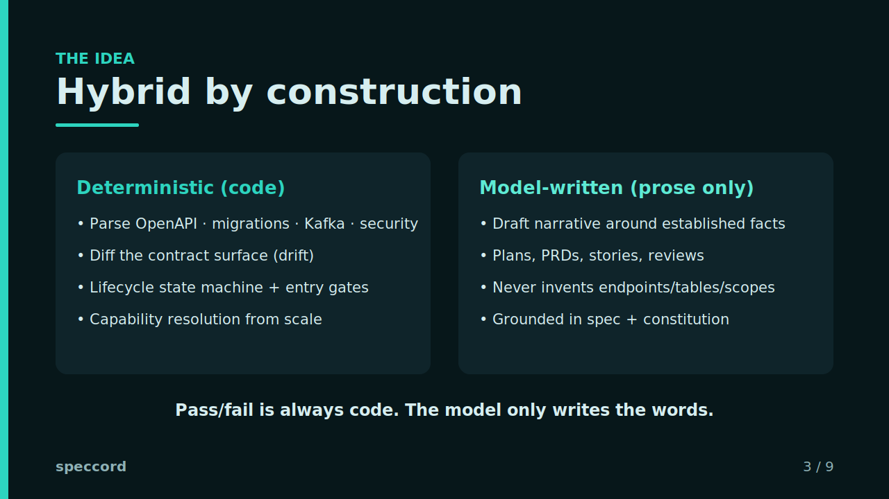

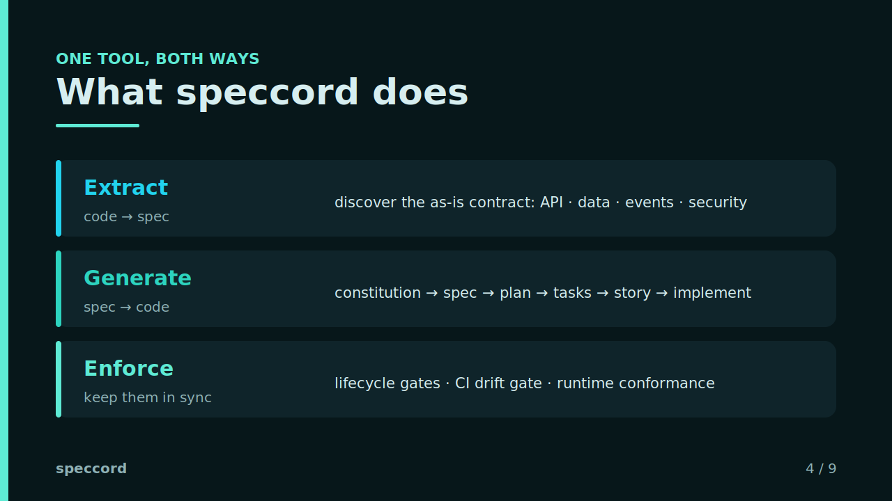

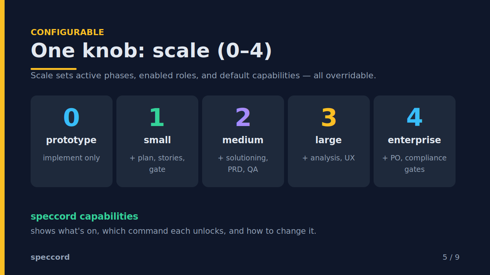

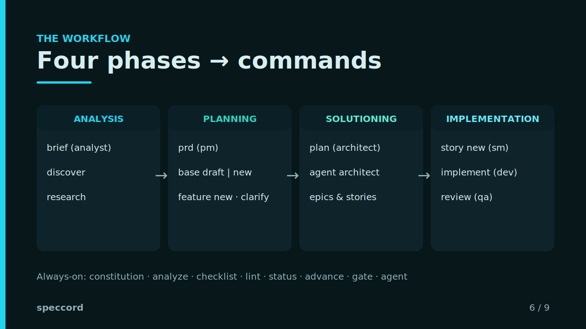

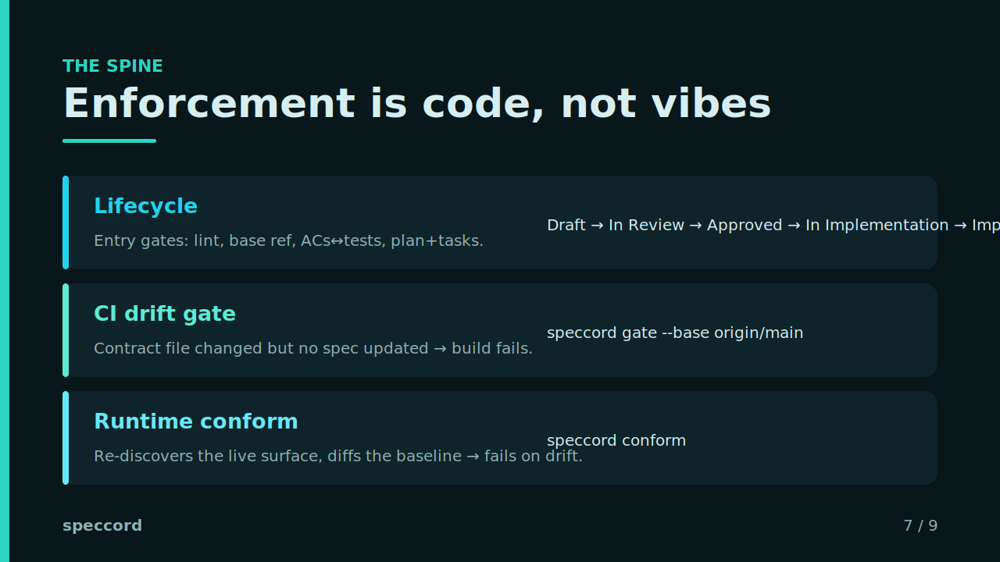

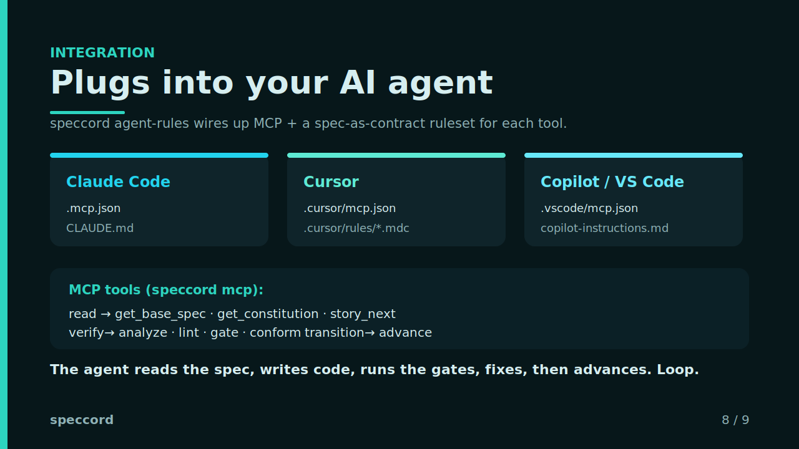

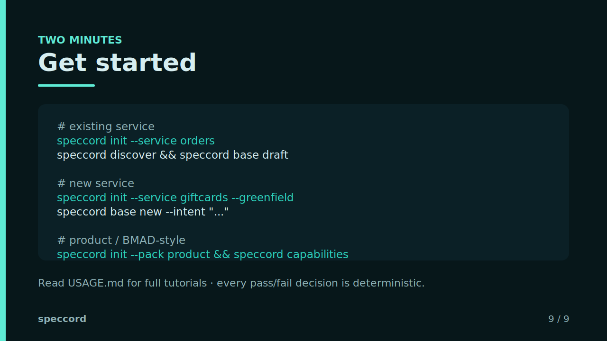

</details>

> Slides are generated from [docs/slides/build_slides.py](docs/slides/build_slides.py); the editable
> deck is [speccord-deck.pptx](docs/speccord-deck.pptx).

## Interactive demo

A scripted, video-style walkthrough of the whole workflow with **play / pause / resume / back /
next** controls — runs entirely in the browser, no install.

▶ **[Launch the live demo](https://krishnachaitanyap.github.io/speccord/)** (hosted on GitHub Pages)

[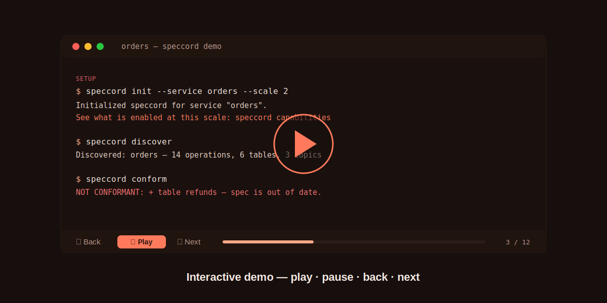](https://krishnachaitanyap.github.io/speccord/)

Prefer local? It's a single self-contained file — open `docs/demo/index.html` in any browser, or run
`node docs/demo/serve.cjs` → http://localhost:8732. Space = play/pause, ← / → = back/next.

## Requirements

- Node.js >= 18
- (Optional) `ANTHROPIC_API_KEY` for LLM-drafted prose and agent personas. Without it everything
  still runs and emits deterministic skeletons / persona stubs.

## Install

```bash
npm install && npm run build
npm link        # or call ./bin/run.js
```

## Configure how you work (the one knob that matters)

`init` picks a **scale** (0–4) or a **pack**; `capabilities` shows you exactly what that turns on.

```bash
speccord init --service orders --scale 2          # 0 prototype · 1 small · 2 medium · 3 large · 4 enterprise
speccord init --service orders --pack enterprise  # packs bundle scale + gate policy
speccord capabilities                             # what's enabled now + how to change it
speccord capabilities --scales                    # the 5 scale levels
speccord capabilities --packs                     # the 5 packs
```

| Scale | Phases | Adds |
|---|---|---|
| 0 prototype | implementation | conformance only, no ceremony |
| 1 small | planning, implementation | architecture, stories, lifecycle, gate |
| 2 medium *(default)* | + solutioning | PRD, QA review |
| 3 large | + analysis | ideation (brief), UX |
| 4 enterprise | all | product ownership (PO) + compliance gates |

Packs: `service-brownfield`, `service-greenfield`, `product`, `enterprise`, `prototype`.

Every capability is an individual toggle in `speccord.config.yaml` (`capabilities.<name>: true|false`),
so the scale just sets sensible defaults you can override.

## Quick starts

### Brownfield (existing service)

```bash
speccord init --service orders
speccord discover            # parse OpenAPI/migrations/Kafka/security → report + baseline
speccord base draft          # confirm facts → base spec (the technical contract)
```

### Greenfield (new service)

```bash
speccord init --service giftcards --greenfield
speccord base new --intent "Issue and redeem gift cards; owns balances; called by checkout"
```

### Product workflow (scale 3–4)

```bash
speccord init --service giftcards --pack product
speccord brief --idea "..."        # analyst → product brief
speccord prd                       # PM → PRD with prioritized epics
speccord story new --epic EPIC-1 --title "Issue a card"   # SM → context-engineered story
```

### The forward workflow (any mode)

```bash
speccord constitution                            # principles (P-n)  [once]
speccord feature new --id SPEC-142 --title "Order cancellation"
speccord clarify   specs/features/SPEC-142-order-cancellation.md
speccord plan      specs/features/SPEC-142-order-cancellation.md
speccord tasks     specs/features/SPEC-142-order-cancellation.md
speccord analyze   specs/features/SPEC-142-order-cancellation.md   # deterministic cross-check
speccord checklist specs/features/SPEC-142-order-cancellation.md
speccord advance   specs/features/SPEC-142-order-cancellation.md --to Approved
speccord implement specs/features/SPEC-142-order-cancellation.md   # prompt pack, or --execute
speccord review    specs/features/SPEC-142-order-cancellation.md --lens edge-cases
```

### Enforce in CI

```bash
speccord gate    --base origin/main   # contract file changed but no spec updated → fail
speccord conform                      # running code drifted from baseline → fail
speccord conform --update-baseline    # accept current surface (after the spec documents it)
```

## Agent personas

Each role is an inspectable prompt, not a hidden chat. `agent list` shows which are enabled at your
scale; run any over an input:

```bash
speccord agent list
speccord agent qa        --input specs/features/SPEC-1-*.md
speccord agent architect --input specs/base/orders.md --task "propose epics" --out epics.md
```

| Role | Job |
|---|---|
| analyst | research, briefs, document existing systems |
| pm | PRD, scope, prioritized epics |
| ux | flows, UX acceptance criteria |
| architect | technical approach, contract, epics & stories |
| sm | context-engineered stories |
| dev | implement a story/task |
| qa | adversarial / edge-case review, test strategy |
| po | validate intent, course-correct |

## Integrate with AI agents (Claude Code, Cursor, Copilot)

speccord is the **contract layer** an AI coding agent plugs into: the agent generates, speccord
verifies. One command wires it into your tool of choice:

```bash
speccord agent-rules                 # writes MCP config + a spec-as-contract ruleset for all three
speccord agent-rules --tool cursor   # just one
```

What it writes:

| Tool | MCP config | Rules file |
|---|---|---|
| Claude Code | `.mcp.json` | `CLAUDE.md` |
| Cursor | `.cursor/mcp.json` | `.cursor/rules/speccord.mdc` |
| Copilot / VS Code | `.vscode/mcp.json` | `.github/copilot-instructions.md` |

The MCP server (`speccord mcp`, stdio) exposes speccord as native agent tools:

- **read** (ground truth): `speccord_get_base_spec`, `speccord_get_constitution`, `speccord_get_file`,
  `speccord_capabilities`, `speccord_status`, `speccord_stories`, `speccord_story_next`
- **verify** (the gates): `speccord_analyze`, `speccord_lint`, `speccord_gate`, `speccord_conform`,
  `speccord_discover`
- **transition**: `speccord_advance`, `speccord_story_advance`, `speccord_update_baseline`

The loop it enforces: the agent reads the spec, writes code, calls the verify tools, fixes what they
report, and only then advances the lifecycle. Every verifier also has a `--json` flag for agents/CI
that shell out instead of using MCP. See [USAGE.md §15](USAGE.md#15-integrating-with-ai-agents).

## Command map

| Phase | Commands |
|---|---|
| Analysis | `brief`, `discover` (brownfield) |
| Planning | `prd`, `base draft` / `base new`, `feature new`, `clarify` |
| Solutioning | `plan`, `agent architect` (epics) |
| Implementation | `story new\|list\|next\|advance\|implement`, `tasks`, `implement`, `review`, `agent dev` |
| Always-on | `constitution`, `analyze`, `checklist`, `lint`, `status`, `advance`, `gate`, `conform`, `capabilities`, `agent` |
| Agent integration | `mcp` (MCP server), `agent-rules` (wire up Claude Code / Cursor / Copilot) |

## Lifecycle & gates

Spec status: `Draft → In Review → Approved → In Implementation → Implemented → Superseded`.
Story status: `Draft → Ready → In Progress → Review → Done`.

Entry gates (configurable via preset/customization):
- **Approved** — lint passes, base version referenced. (`compliance`: + checklist complete, no open
  clarifications.)
- **In Implementation** — every `AC-n` links to a test, and a plan + tasks exist.

## Architecture

Three interfaces (CLI, MCP server, generated agent rules) sit on one reusable core; deterministic
engines produce/verify facts, and the model only drafts prose. Everything reads/writes the same
artifacts under `specs/` and `.speccord/`.

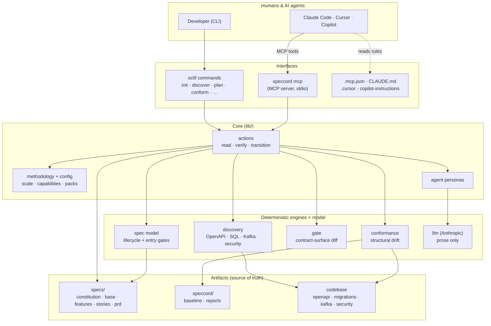

## Flows

**The workflow** — both entry modes converge on one forward path; deterministic checks gate it.

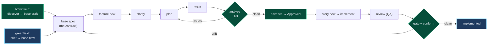

**Spec lifecycle** — hard transitions, each with an entry gate.

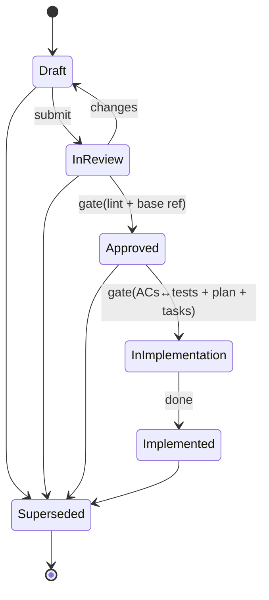

**The agent loop** — generate fast, verify deterministically, advance only when green.

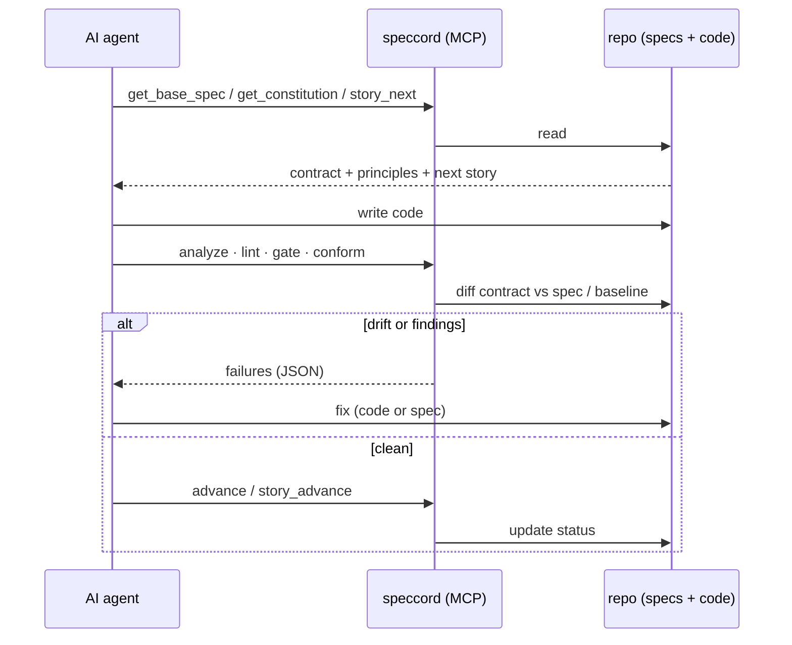

## Layout

```
src/
  commands/        # init, discover, base/(draft|new), constitution, brief, prd,
                   #   feature/new, clarify, plan, tasks, analyze, checklist,
                   #   story/(new|list|next|advance|implement), implement, review, agent,
                   #   status, lint, advance, gate, conform, capabilities,
                   #   mcp (MCP server), agent-rules (agent integration)
  lib/
    actions.ts     # reusable verify/transition/read actions (CLI + MCP share these)
    gate.ts        # CI drift-gate logic
    agentrules.ts  # ruleset + per-tool MCP config (Claude Code / Cursor / Copilot)
    methodology.ts # scale levels, phases, roles, capability model (the config layer)
    agents.ts      # agent persona registry + runPersona()
    config.ts      # config, packs, presets, capability resolution
    discovery/     # provider registry: builtin + custom + plugin parsers (stack-agnostic)
    conformance/   # structural drift diff + external-check runner
    llm/           # Anthropic hybrid drafting
    spec/          # model, lifecycle+gates, front-matter, templates, constitution,
                   #   prd, plan, tasks, checklist, story, analyze, feature loader
```

## Design invariant

Anything that decides pass/fail — gates, the lifecycle, drift detection, analysis, capability
resolution — is **code, not a prompt**. Personas and drafters only write prose around facts the tool
has already established. That is what keeps the spec trustworthy as the contract the code is
continuously checked against, no matter how much agent automation you layer on top.
